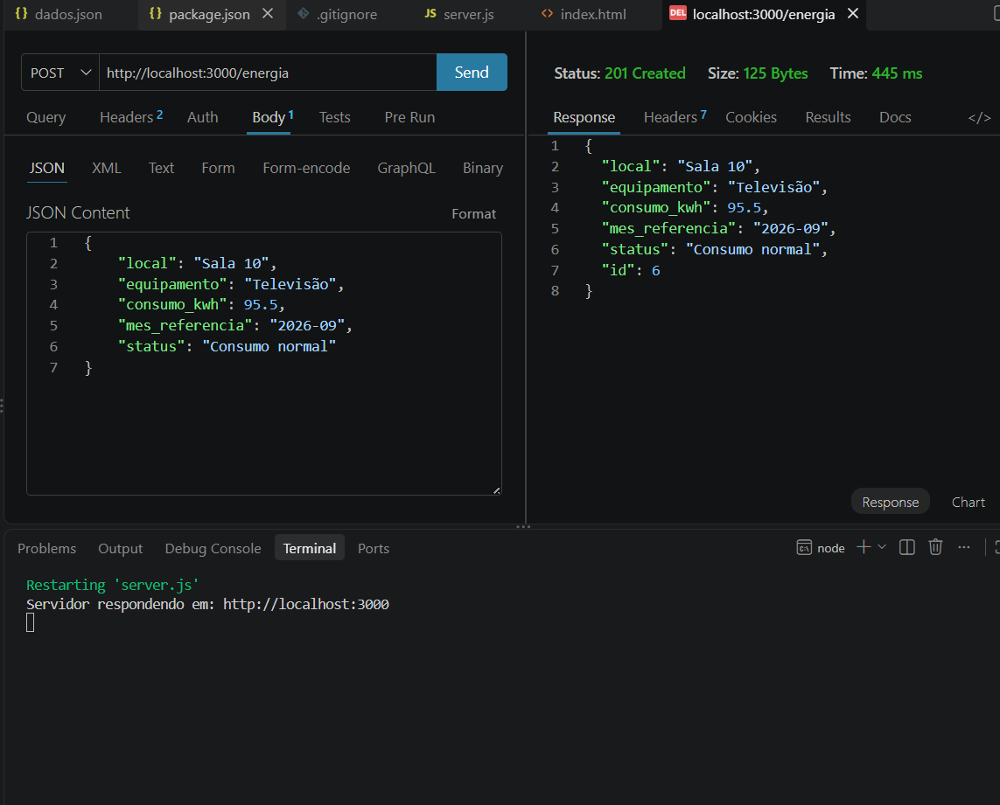
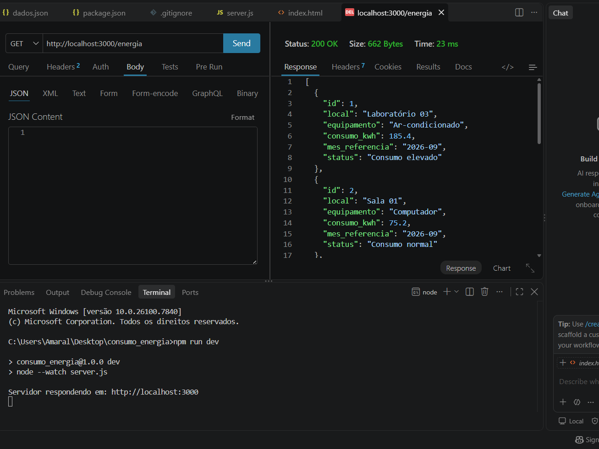
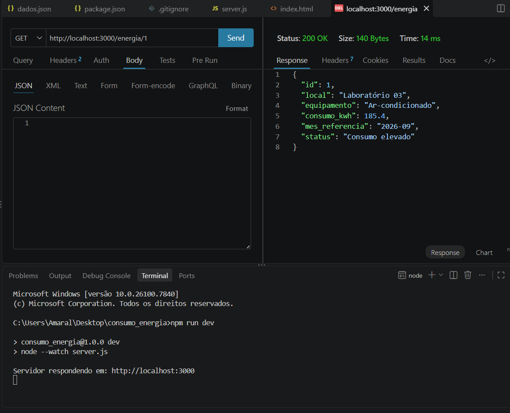
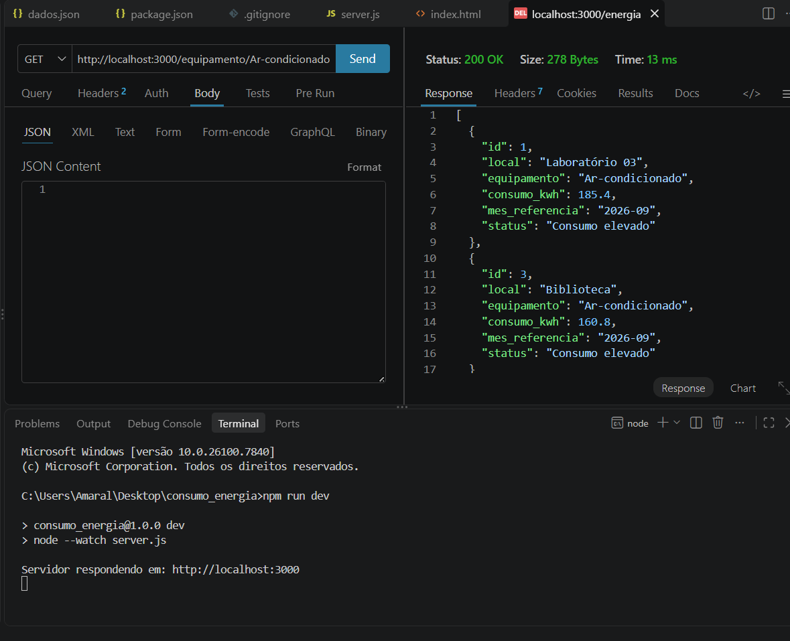
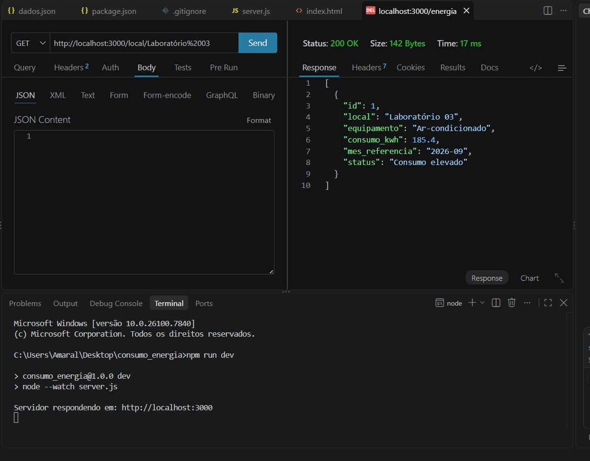
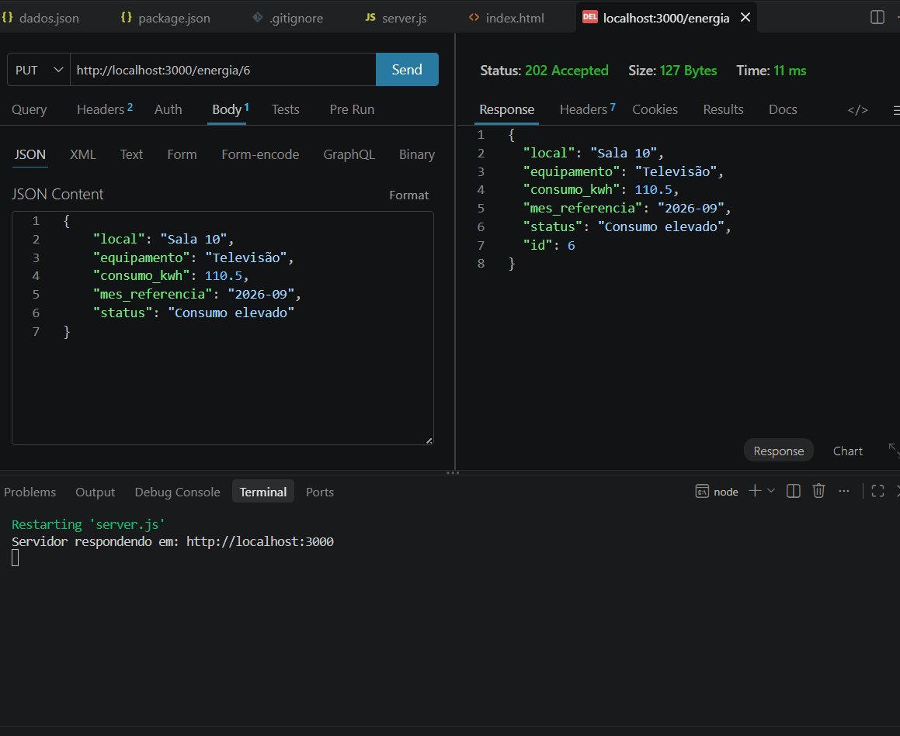
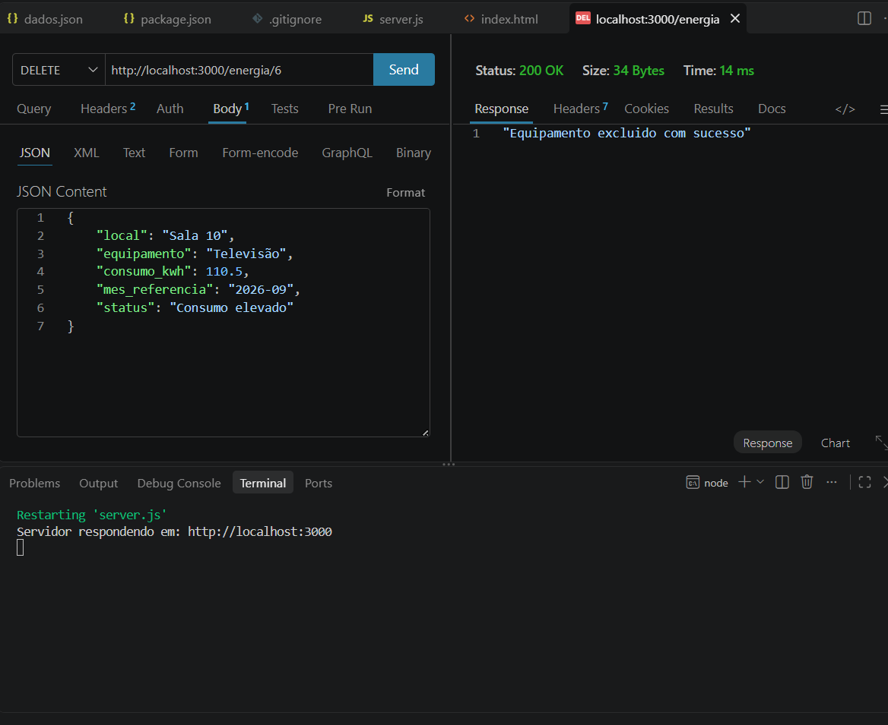
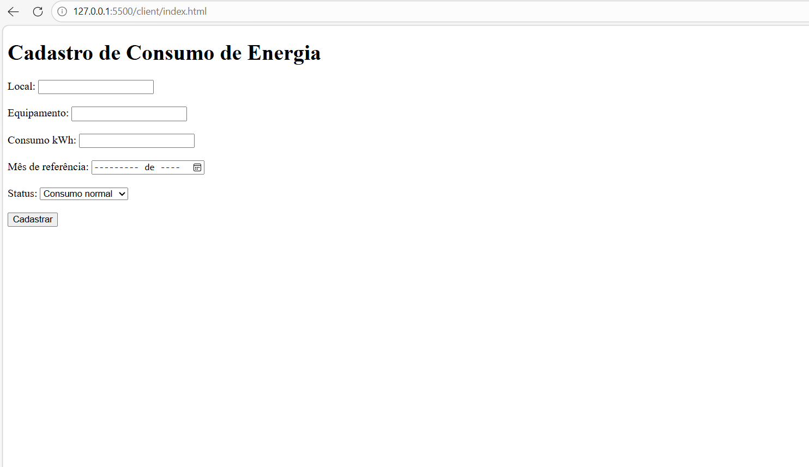
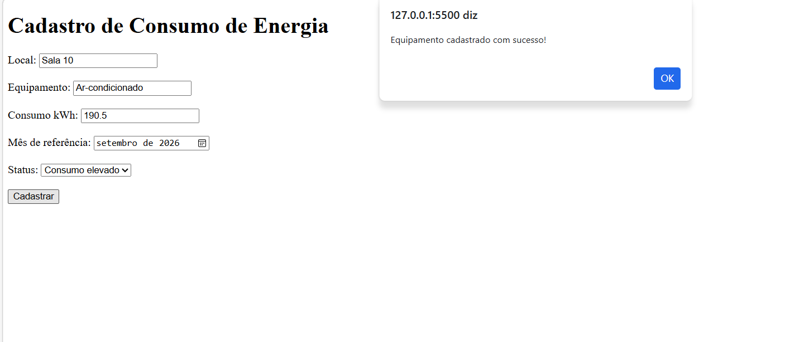

# Consumo de Energia Back-end

Exemplo simples de back-end com mockup de dados JSON e funcionalidades CRUD para rastreamento de consumo e desperdício de energia.

---

## Tecnologias

* **Node.js**
* **JavaScript**
* **Express**
* **CORS**
* **VsCode**
* **VsCode Thunder Client**

---

## Passos para testar

* 1 Clone este repositório
* 2 Abra com **VsCode** e em um terminal digite:

```bash
npm install
npm run dev
```

* 3 Teste as rotas com a extensão `Thunder Client` do **VsCode**
* 4 Abra o arquivo `client/index.html` com a extensão `Live Server` do **VsCode**

---

## Print dos testes e exemplo de requisições

* CREATE



* READ ALL



* BUSCAR POR ID



* BUSCAR POR EQUIPAMENTO



* BUSCAR POR LOCAL



* UPDATE



* DELETE



---

## Cliente

* Formulário



* Resposta:


